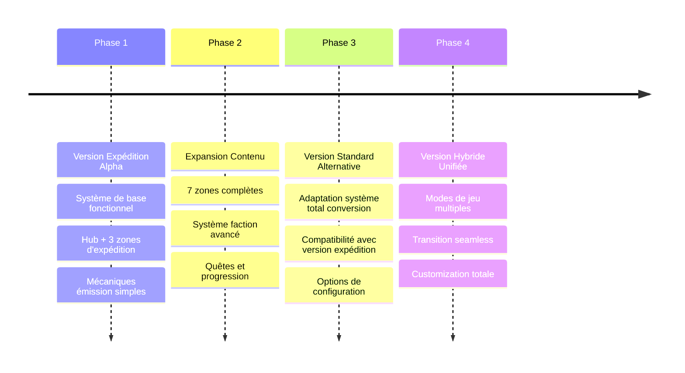

# Comparaison des Versions : Standard vs Expédition

## 📊 **Analyse Comparative Complète**

Nous avons développé **deux approches distinctes** pour le mod CDDA Zone, chacune avec ses avantages et son public cible.

## 🎮 **Version 1: Total Conversion Standard**

### **Concept de Base**
Transforme complètement CDDA en univers S.T.A.L.K.E.R. permanent où le joueur vit dans la Zone.

### **Avantages**
✅ **Immersion Totale** : Le monde entier devient la Zone  
✅ **Exploration Libre** : Pas de contraintes temporelles artificielles  
✅ **Progression RPG Classique** : Système familier aux joueurs CDDA  
✅ **Contenu Massif** : Toute la map devient explorable avec thème Zone  
✅ **Flexibilité Gameplay** : Joueur choisit son rythme et style  
✅ **Compatibilité Mods** : Plus facile d'intégrer avec autres mods CDDA  

### **Défis**
❌ **Dilution de la Tension** : Danger constant devient routine  
❌ **Perte d'Authenticité** : S.T.A.L.K.E.R. n'est pas "vivre dans la Zone"  
❌ **Pacing Problems** : Rythme lent typique CDDA vs intensité S.T.A.L.K.E.R.  
❌ **Scale Issues** : Zone devient trop grande, perd mystère/danger  
❌ **Resource Inflation** : Trop d'artefacts disponibles, économie brisée  

### **Public Cible**
- **Joueurs CDDA vétérans** cherchant nouveau thème
- **Fans RPG progression** lente et méthodique  
- **Explorateurs** préférant liberté totale
- **Builders** voulant établir bases permanentes

---

## ⚡ **Version 2: Système Expéditions (Inspiré Innawood)**

### **Concept de Base**
Hub sécurisé + expéditions temporaires dangereuses dans la Zone, avec retour obligatoire.

### **Avantages**
✅ **Authenticité S.T.A.L.K.E.R.** : Fidèle à l'esprit original des jeux  
✅ **Tension Constante** : Chaque expédition est un événement à enjeux  
✅ **Pacing Optimal** : Sessions intenses focalisées sur objectifs  
✅ **Progression Significative** : Chaque succès a un impact réel  
✅ **Rejouabilité Élevée** : Multiples approches, stratégies, défis  
✅ **Risk/Reward Équilibré** : Décisions critiques avec vraies conséquences  
✅ **Économie Stable** : Scarcité maintenue, valeur préservée  
✅ **Innovation Gameplay** : Nouveau pour CDDA, unique expérience  

### **Défis**
❌ **Complexité Technique** : Système plus complexe à implémenter  
❌ **Courbe d'Apprentissage** : Joueurs doivent apprendre nouvelles mécaniques  
❌ **Contraintes Temporelles** : Certains joueurs n'aiment pas la pression  
❌ **Moins de Liberté** : Structure plus guidée que CDDA typique  
❌ **Compatibilité Limitée** : Plus difficile d'intégrer autres mods  

### **Public Cible**  
- **Fans S.T.A.L.K.E.R. authentiques** cherchant vraie expérience Zone
- **Joueurs aimant challenge** avec tension et time pressure
- **Amateurs session courtes** plutôt que campagnes longues
- **Innovateurs** voulant expérimenter nouveaux systèmes CDDA

---

## 📈 **Matrice de Comparaison Détaillée**

| **Critère** | **Version Standard** | **Version Expédition** | **Gagnant** |
|-------------|---------------------|------------------------|-------------|
| **Fidélité S.T.A.L.K.E.R.** | 6/10 | 9/10 | 🏆 Expédition |
| **Accessibilité CDDA** | 9/10 | 6/10 | 🏆 Standard |
| **Innovation Gameplay** | 4/10 | 9/10 | 🏆 Expédition |
| **Facilité Implémentation** | 7/10 | 4/10 | 🏆 Standard |
| **Rejouabilité Long-terme** | 6/10 | 9/10 | 🏆 Expédition |
| **Tension & Atmosphère** | 5/10 | 10/10 | 🏆 Expédition |
| **Compatibilité Mods** | 8/10 | 4/10 | 🏆 Standard |
| **Courbe Apprentissage** | 3/10 | 7/10 | 🏆 Standard |
| **Progression Satisfaisante** | 7/10 | 9/10 | 🏆 Expédition |
| **Liberté Exploration** | 10/10 | 5/10 | 🏆 Standard |

### **Score Total**
- **Version Standard** : 65/100
- **Version Expédition** : 72/100

---

## 🎯 **Recommandations par Profil Joueur**

### **Choisir Version Standard Si :**
- ✅ Nouveau à S.T.A.L.K.E.R., mais familier avec CDDA
- ✅ Préfère exploration libre et construction de base  
- ✅ Aime progression lente et méthodique
- ✅ Veut jouer avec d'autres mods CDDA
- ✅ Session longues (2+ heures) de jeu détendu
- ✅ N'aime pas contraintes temporelles artificielles

### **Choisir Version Expédition Si :**
- ✅ Fan authentique de S.T.A.L.K.E.R. (joué aux jeux originaux)
- ✅ Cherche expérience intense et challengeante
- ✅ Préfère sessions courtes (30min-2h) focalisées
- ✅ Aime gameplay avec time pressure et decisions critiques  
- ✅ Veut quelque chose de vraiment nouveau pour CDDA
- ✅ Apprécie systèmes de progression reputation-based

---

## 🚀 **Stratégie de Développement Recommandée**

### **Phase 1: Implémentation Parallèle**
Développer les **deux versions simultanément** avec code partagé :

```
cdda-zone-mod/
├── shared/          # Artefacts, mutants, équipement commun
├── standard/        # Version total conversion
├── expedition/      # Version système expéditions  
└── hybrid/          # Version combinée (futur)
```

### **Phase 2: Test Communautaire**
- **Alpha Testing** des deux approches
- **Feedback Priorité** des joueurs S.T.A.L.K.E.R. vs CDDA
- **Métriques Engagement** : temps de jeu, sessions répétées
- **Préférences Communautaires** : sondages et discussions

### **Phase 3: Optimisation Basée Feedback**
- **Version Populaire** reçoit développement prioritaire
- **Version Alternative** maintenue comme option
- **Fonctionnalités Cross-Pollination** entre versions

### **Phase 4: Version Hybride (Avancée)**
Combiner le meilleur des deux :
- **Mode Expédition** comme option gameplay
- **Mode Libre** comme alternative débloquée
- **Transition** possible entre les deux styles
- **Customization** complète par le joueur

---

## 💡 **Innovation Technique : Version Hybride**

### **Concept Unifié Avancé**
```json
{
  "gameplay_modes": {
    "expedition": {
      "enabled": true,
      "hub_location": "cordon_checkpoint",
      "time_limits": true
    },
    "freeform": {
      "enabled": true,  
      "unlock_condition": "veteran_reputation",
      "permanent_zone_access": true
    },
    "hardcore": {
      "enabled": false,
      "permadeath": true,
      "emission_frequency": "extreme"
    }
  }
}
```

### **Progression Naturelle**
1. **Débutant** : Mode Expédition obligatoire (apprentissage sécurisé)
2. **Expérimenté** : Choix entre Expédition ou Free-form
3. **Vétéran** : Accès permanent Zone + options avancées
4. **Maître** : Mode Hardcore débloqué
5. **Légende** : Customization complète des règles

### **Flexibilité Maximale**
- **Mid-Game Transition** : Basculer entre modes selon préférence
- **Saves Compartimentés** : Progression séparée par mode
- **Difficulty Scaling** : Ajustements per-mode indépendants
- **Content Gating** : Certaines zones/items uniquement en mode spécifique

---

## 🏆 **Verdict Final**

### **Recommandation Développement**

**Commencer par Version Expédition** pour ces raisons :

1. **Plus Innovante** : Apporte quelque chose de vraiment nouveau à CDDA
2. **Plus Authentique** : Respecte l'esprit S.T.A.L.K.E.R. original  
3. **Différentiation Claire** : Se distingue des autres mods de thème
4. **Proof of Concept** : Démontre faisabilité systèmes avancés
5. **Community Impact** : Potentiel d'influencer future modding CDDA

### **Roadmap Suggérée**



---

## 🎭 **Conclusion : L'Évolution du Modding CDDA**

Ce projet représente plus qu'un simple mod thématique - c'est une **exploration des possibilités** de ce que CDDA peut devenir avec des systèmes innovants inspirés d'autres genres de jeux.

La **Version Expédition** pousse les limites de ce qui est possible dans CDDA, créant une expérience de gameplay entièrement nouvelle tout en restant fidèle aux mécaniques fondamentales du jeu.

La **Version Standard** offre une approche plus conservatrice qui respecte les attentes des joueurs CDDA existants tout en apportant l'atmosphère riche de l'univers S.T.A.L.K.E.R.

**Les deux versions ont leur place** dans l'écosystème CDDA, servant des audiences différentes et démontrant la flexibilité remarquable du moteur de jeu.

*"In the Zone, there are many paths to the Center. Some stalkers prefer the quick and dangerous route, others take the long road. Both can lead to success - or death. Choose wisely, Stalker."*

---

**Статус проекта: Готов к имплементации обеих версий** ✅  
**Рекомендация: Начать с Экспедиционной версии** 🚀  
**Потенциал: Революция в CDDA моддинге** 🌟